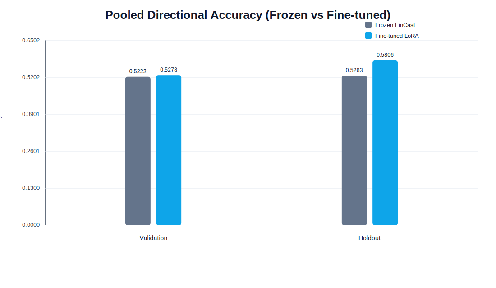
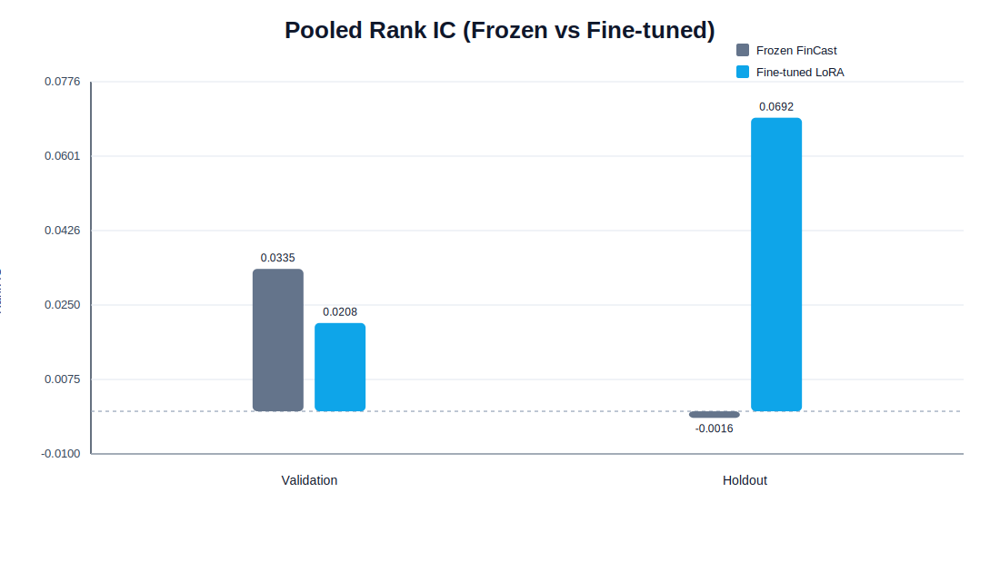
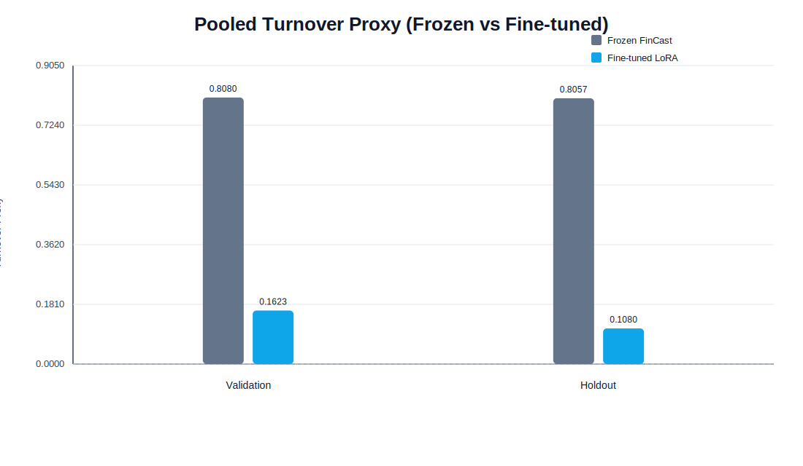
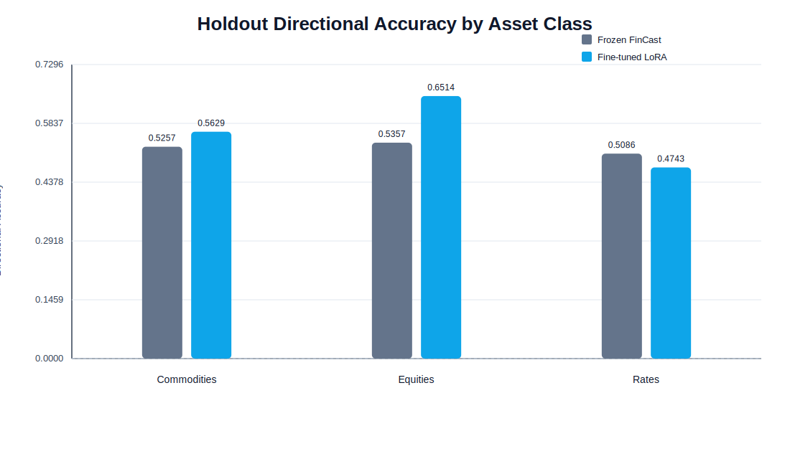
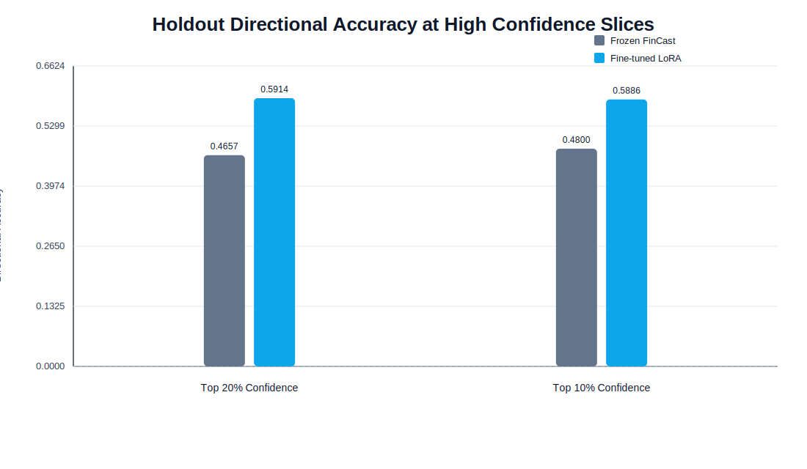

# Alpha Edge

## FinCast Fine-Tune Metrics and Evaluation

This README documents the current checked-in FinCast LoRA artifacts in `models/fincast_runtime_local` and the current backend/frontend implementation behavior.

### Run Snapshot

- Run timestamp (UTC): `2026-03-24T05:33:30.394853+00:00`
- Base model: frozen FinCast checkpoint (`v1.pth`)
- Fine-tune type: LoRA (`lora_r=8`, `lora_alpha=16`, `dropout=0.05`, `attn_mlp` targets)
- Selection metric: validation `rank_ic` (best epoch: `3`)
- Target: 5-day forward return
- Universe: `ES, NQ, RTY, YM, ZN, ZB, CL, NG, GC, HG`
- Splits:
  - Train: `2017-07-09` to `2023-12-22`
  - Validation: `2024-01-01` to `2024-12-25`
  - Holdout: `2025-01-01` to `2025-12-25`

### Evaluation Protocol

Metrics are computed in `alpha_model/training/fincast_lora_colab.py`:

- `directional_accuracy`: sign agreement between prediction and target
- `rank_ic`: per-date rank correlation, then mean over dates
- `top_bottom_spread`: average top-minus-bottom bucket target spread per date
- `turnover_proxy`: mean sign-change rate through time per symbol

Reporting slices:

- `pooled::all`
- `asset_class::{commodities,equities,rates}`
- `confidence_top_20pct::*` and `confidence_top_10pct::*` using `|prediction|` confidence filters

### Pooled Results (Frozen vs Fine-Tuned)

| Split | Rows | Frozen DA | LoRA DA | DA Delta | Frozen Rank IC | LoRA Rank IC | Rank IC Delta | Frozen Spread | LoRA Spread | Spread Delta | Frozen Turnover | LoRA Turnover |
|---|---:|---:|---:|---:|---:|---:|---:|---:|---:|---:|---:|---:|
| Validation | 1760 | 0.5222 | 0.5278 | +0.0057 | 0.0335 | 0.0208 | -0.0127 | 0.0034 | 0.0011 | -0.0023 | 0.8080 | 0.1623 |
| Holdout | 1750 | 0.5263 | 0.5806 | +0.0543 | -0.0016 | 0.0692 | +0.0707 | -0.0039 | -0.0001 | +0.0038 | 0.8057 | 0.1080 |

### Holdout Directional Accuracy by Asset Class

| Slice | Frozen DA | LoRA DA | Delta |
|---|---:|---:|---:|
| Commodities | 0.5257 | 0.5629 | +0.0371 |
| Equities | 0.5357 | 0.6514 | +0.1157 |
| Rates | 0.5086 | 0.4743 | -0.0343 |

### Holdout Confidence Slices (Directional Accuracy)

| Slice | Frozen DA | LoRA DA | Delta | Rows (LoRA) |
|---|---:|---:|---:|---:|
| Top 20% confidence (all) | 0.4657 | 0.5914 | +0.1257 | 350 |
| Top 10% confidence (all) | 0.4800 | 0.5886 | +0.1086 | 175 |

### Baseline Context (Holdout, pooled::all)

| Model | Directional Accuracy | Rank IC | Top-Bottom Spread | Turnover Proxy | Rows |
|---|---:|---:|---:|---:|---:|
| Zero | 0.0040 | 0.0000 | 0.6376 | 0.0000 | 3020 |
| Momentum (5d) | 0.4825 | -0.0370 | -0.2793 | 0.3887 | 3020 |
| Linear | 0.5669 | -0.0220 | -0.2698 | 0.0558 | 3020 |
| Fine-tuned LoRA | 0.5806 | 0.0692 | -0.0001 | 0.1080 | 1750 |

Notes:

- Baseline files (`holdout_metrics.json`) and LoRA files (`custom_lora_*_metrics.json`) use different evaluation row counts, so compare as directional context, not a strict apples-to-apples leaderboard.
- Some confidence/asset slices can be very small (especially `rates`), so pooled and major asset-class slices are the most stable.

### Evaluation Graphs

The graphs below are generated directly from the metrics JSON artifacts in `models/fincast_runtime_local`.

Generation command:

```bash
python3 scripts/generate_fincast_eval_graphs.py
```

Pooled directional accuracy:



Pooled rank IC:



Pooled turnover proxy:



Holdout directional accuracy by asset class:



Holdout high-confidence directional accuracy slices:



### Artifact Files

- `models/fincast_runtime_local/training_status.json`
- `models/fincast_runtime_local/frozen_fincast_summary.json`
- `models/fincast_runtime_local/custom_lora_validation_metrics.json`
- `models/fincast_runtime_local/custom_lora_holdout_metrics.json`
- `models/fincast_runtime_local/frozen_vs_lora_comparison.json`
- `models/fincast_runtime_local/custom_lora_history.csv`
- `models/fincast_runtime_local/config_manifest.json`
- `scripts/generate_fincast_eval_graphs.py`
- `docs/figures/fincast_eval_pooled_directional_accuracy.svg`
- `docs/figures/fincast_eval_pooled_rank_ic.svg`
- `docs/figures/fincast_eval_pooled_turnover.svg`
- `docs/figures/fincast_eval_holdout_asset_class_directional_accuracy.svg`
- `docs/figures/fincast_eval_holdout_confidence_directional_accuracy.svg`

## Agentic System Details

### System Overview

This section reflects the current code path in `backend/app/api/endpoints/analysis.py` (as of March 25, 2026), not a future/target architecture.

Alpha Edge runs a background async investment-committee workflow behind a FastAPI backend, with per-session state persisted in Redis.

Core flow:

1. Generate alpha forecasts from the selected forecast engine.
2. Run 5 specialist agents in parallel (quant, fundamentals, sentiment, risk, macro).
3. Extract claims and run cross-agent debate.
4. Synthesize a final investment memo with recommendation and position sizing.

Primary implementation files:

- `backend/app/api/endpoints/analysis.py`
- `backend/app/agents/orchestrator.py`
- `backend/app/agents/tools.py`
- `backend/app/agents/prompts.py`
- `backend/app/models/schemas.py`

### Forecast Engines (Chronos-2 + FinCast LoRA)

The API supports two forecast engines via `forecast_model`:

- `chronos`
- `fincast_lora`

Chronos path details (`forecast_model="chronos"`):

- UI/agent prompts label this option as "Chronos-2", while implementation loads `ChronosBoltPipeline` from the configured model ID (default: `amazon/chronos-bolt-base`).
- Inference is based on log-return context with `context_length=512`.
- Forecast horizon is rolled up to `1d`, `5d`, `21d`, and `63d`.
- Uses Chronos quantiles (`0.1..0.9`) and maps:
  - `q10` = index `0`
  - `q50` = index `4` (point alpha)
  - `q90` = index `8`
- Output includes:
  - `alpha_1d/5d/21d/63d`
  - `q10_*` and `q90_*` bands
  - `model_version="chronos-2:<model_name>"`
  - `training_fold="pretrained"`
- Current implementation sets `patch_attention=[]` and `top_features=[]` (no populated interpretability payload yet).

Fine-tuned FinCast LoRA details (`forecast_model="fincast_lora"`):

- Loads base FinCast checkpoint + LoRA adapter at runtime.
- Supports the trained futures universe:
  - `ES, NQ, RTY, YM, ZN, ZB, CL, NG, GC, HG`
- Uses iterative rollout with step horizon (`fincast_step_horizon`, default `5`) to reach `63d`.
- Uses adapter metadata for run provenance (`training_status.json` / best epoch info).
- Current implementation also sets `patch_attention=[]` and `top_features=[]`.

Fallback behavior:

- If `chronos` inference fails during analysis, pipeline falls back to a placeholder forecast payload and continues.
- If `fincast_lora` is explicitly selected and fails, it raises an error (no silent fallback).

Primary implementation file:

- `backend/app/services/prediction/inference.py`

### Agent Roles and Tooling

Agents:

- `quant`: price and alpha signal interpretation
- `fundamentals`: valuation, statements, analyst estimates
- `sentiment`: web/reddit/news extraction
- `risk`: options, short interest, VaR/CVaR, stress scenarios
- `macro`: yield curve, macro market proxies, regime detection

Data/tool sources used by tools:

- Yahoo Finance (prices, fundamentals, options, short interest)
- Brave Search (web/news)
- Bright Data (Reddit)
- FRED (rates/yield curve)

Tool registry and assignments:

- `backend/app/agents/tools.py` (`AGENT_TOOLS`)

Failure behavior:

- Tool failures are returned as structured error payloads (dicts) and analysis proceeds with partial data.
- This is intentional graceful degradation at the tool layer.

### Hallucination Guardrails

Guardrail strategy:

- Every pre-fetched tool result is stored in `trace` events.
- Agent evidence is checked against actual tool traces.
- Mismatches trigger correction prompts and a repair pass before downstream rounds.

Validation logic:

- Missing tool call for cited evidence = error.
- Value mismatch vs tool payload = warning.

Primary file:

- `backend/app/core/hallucination_guard.py`

### API and Streaming Contract

Base API prefix:

- `/api/v1`

Main analysis endpoints:

- `POST /analysis` starts a new session.
- `GET /analysis/{analysis_id}` returns full current state.
- `GET /analysis/{analysis_id}/memo` returns final memo when complete.
- `WS /ws/analysis/{analysis_id}` streams status and deltas.

WebSocket event types:

- `status_update`
- `alpha_prediction`
- `agent_view`
- `agent_debate`
- `memo`
- `error`

Primary files:

- `backend/app/api/endpoints/analysis.py`
- `backend/app/api/endpoints/websocket.py`

### Reliability and Observability

Operational characteristics:

- Redis-backed session state with TTL (`redis_session_ttl_seconds`).
- Startup health checks for Redis, Nemotron, Brave, FRED (Yahoo is non-fatal due to possible rate limits).
- OpenTelemetry tracing spans across predict/rounds/debate/memo synthesis.
- Frontend currently uses REST polling (`pollStatus` every 2s) for live progress updates.
- A WebSocket backend endpoint and client helper exist, but the current store/page flow is polling-first.
- `backend/app/core/circuit_breaker.py` defines breakers, but they are not currently wired into the main request path.

Primary files:

- `backend/app/main.py`
- `backend/app/config.py`
- `backend/app/core/observability.py`
- `frontend/src/api/websocket.ts`
